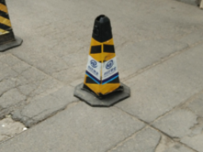
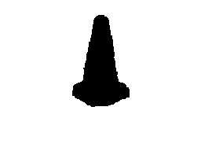
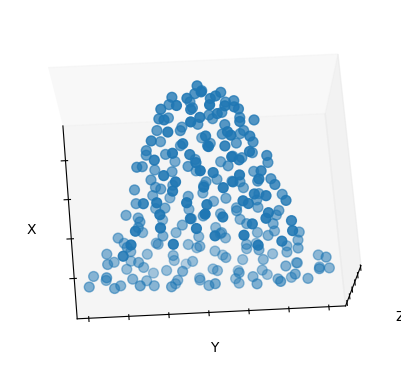
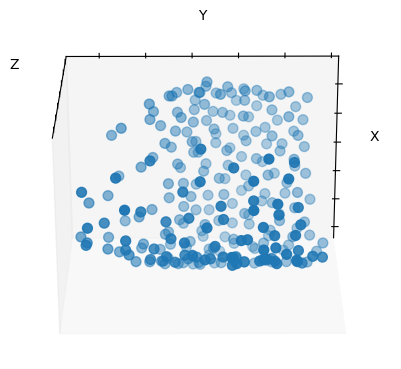
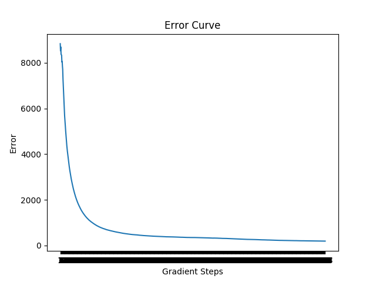

# CV Project Page

## Quick Output
</img>
</img>
</img>


</img>
</img>
</img>

## Paper Title
37, A Point Set Generation Network for 3D Object Reconstruction from a Single Image.
<a href="https://arxiv.org/pdf/1612.00603.pdf"> Link to paper</a>

## Participants
- Anurag Sahu (2018121004)
- Apoorva Srivastava (2019702014)
- Kajal Sanklecha (2019801006)

## Instructions to replicate this on Local Linux System
- make sure you have ```git``` installed on your system
- make sure that you have python 2 installed on your system
Steps:
1. Get the path for python2
``` which python2```
this will return the path where your python2 is installed

2. Create a virtual Environment with python 2
``` virtualenv -p #path to python2
example : virtualenv -p usr/bin/python2 testVenv
```
3. clone the git repo
```
git clone https://github.com/AnuragSahu/CV_Project_2020_3D_Object_Reconstruction_from_a_Single_Image.git
```

4. Activate the environment
```
source ./testVenv/bin/activate
```

5. install the requirements
```
pip install < requirements.txt
```

6. To train
#
to test
#

## Error Plot
<br>
values at the bottom of the plt are crampled.<br>


