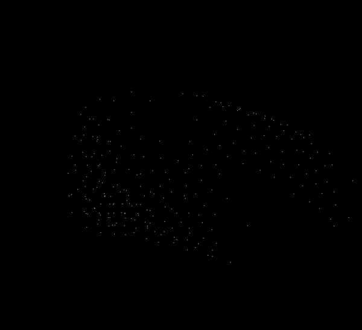

# CV Project Page

## Paper Title
37, A Point Set Generation Network for 3D Object Reconstruction from a Single Image.
<a href="https://arxiv.org/pdf/1612.00603.pdf"> Link to paper</a>

## First Meeting Updates
- Did first part of the Implementation
- Implementation of Vanilla Version 

## Participants
- Anurag Sahu (2018121004)
- Apoorva Shrivastava (2019702014)
- Kajal Sanklecha (2019801006)
