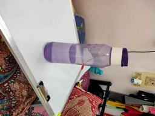
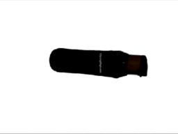
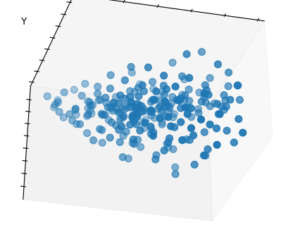
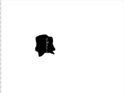
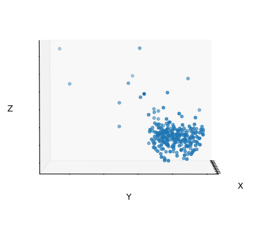
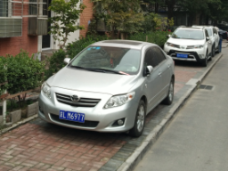
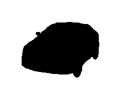
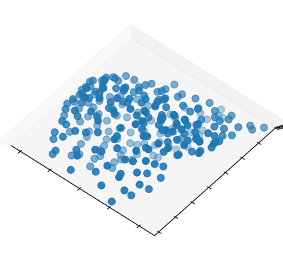

# CV Project Page

## Quick Output
</img>
</img>
</img>


</img>
</img>
</img>


</img>
</img>
</img>


</img>
</img>
</img>


</img>
</img>
</img>

## Paper Title
37, A Point Set Generation Network for 3D Object Reconstruction from a Single Image.
<a href="https://arxiv.org/pdf/1612.00603.pdf"> Link to paper</a>

## Participants
- Anurag Sahu (2018121004)
- Apoorva Srivastava (2019702014)
- Kajal Sanklecha (2019801006)

## Instructions to replicate this on Local Linux System
- make sure you have ```git``` installed on your system
- make sure that you have python 2 installed on your system <br>
Steps:
- Get the path for python2
``` which python2```
this will return the path where your python2 is installed

- Create a virtual Environment with python 2
``` virtualenv -p #path to python2
example : virtualenv -p usr/bin/python2 testVenv
```
- clone the git repo and get into the repo
```
git clone https://github.com/AnuragSahu/CV_Project_2020_3D_Object_Reconstruction_from_a_Single_Image.git
cd ./CV_Project_2020_3D_Object_Reconstruction_from_a_Single_Image/
```
- Activate the environment
```
source ../testVenv/bin/activate
```
- install the requirements
```
pip install -r ./requirements.txt
```
- to test<br> 
download the weights file :  <a href = ""> Link </a> 
```
cd ./V1/src/
python vanillaReconstruct.py \
../images/1.png \
../images/1_m.png \
../vanillaVersionWeights.pkl

python viz.py ../images/1.txt
```

## Test on your Image
make sure that you have the mask image which filters out your object of interest from the background and also the image and mask are of size 256*192
- Place the image and its mask to images folder (lets say that image has name myImage.png and its mask image is myImageMask.png)
- run the code to get the 3d point clouds
```
python vanillaReconstruct.py \
../images/myImage.png \
../images/myImagemask.png \
../vanillaVersionWeights.pkl
```
- Visualize the point cloud
```
python viz.py \
../images/myImage.txt
```
## Error Plot
<br>
values at the bottom of the plot are crampled.<br>


## TODO 
- provide a the weights file
- Write the instructions for Training
