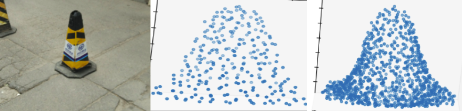

# CV Project Page

## Paper Title
37, A Point Set Generation Network for 3D Object Reconstruction from a Single Image.
<a href="https://arxiv.org/pdf/1612.00603.pdf"> Link to paper</a>

## Participants
- Anurag Sahu (2018121004)
- Apoorva Srivastava (2019702014)
- Kajal Sanklecha (2019801006)

## Quick Output
</img>
## Error Plot
 
values at the bottom of the plot are crampled. 
